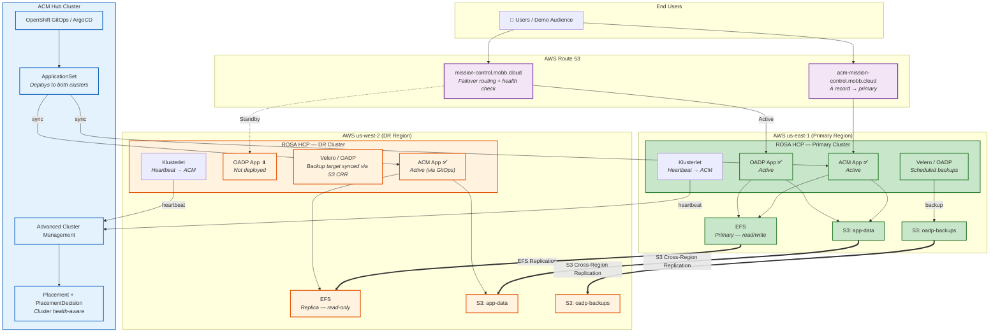
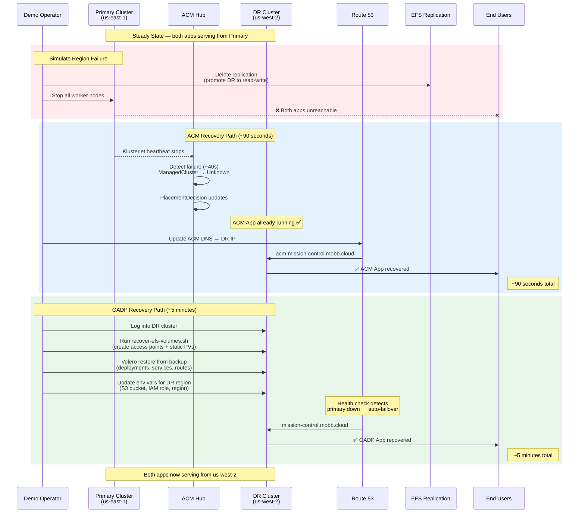
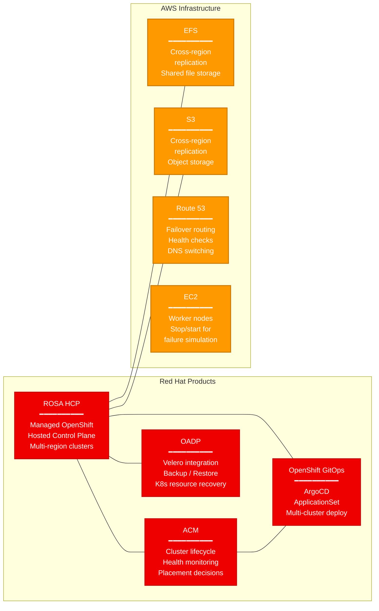

# Architecture: ROSA HCP Disaster Recovery with ACM and OADP

## Steady-State Architecture

## Failover: What Happens When us-east-1 Goes Down

## Component Summary

## Recovery Comparison

| | ACM + GitOps | OADP + Velero |
|---|---|---|
| **RTO** | ~90 seconds | ~5 minutes |
| **Steady-state** | App on both clusters | App on primary only |
| **Failover trigger** | ACM detects via klusterlet | Manual / health check |
| **Recovery steps** | DNS switch only | EFS volumes → Velero restore → env update → DNS |
| **Data strategy** | EFS replication + S3 CRR | EFS replication + S3 CRR + Velero backup |
| **Cost** | Higher (2 clusters active) | Lower (1 cluster active) |
| **Best for** | Low RTO, mission-critical | Cost-sensitive, moderate RTO |
